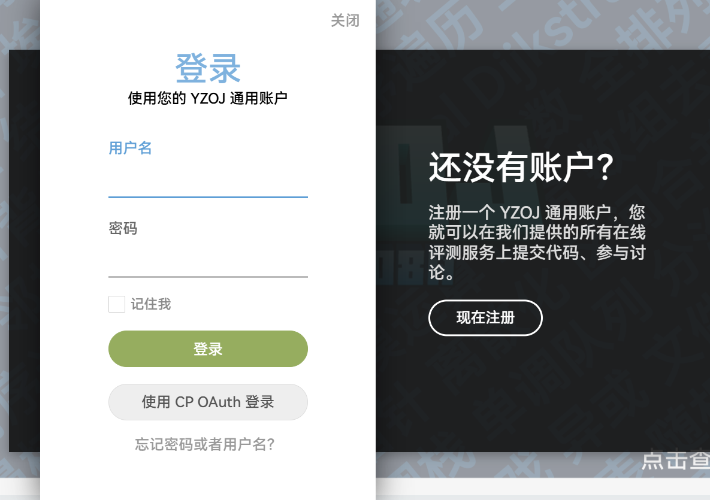
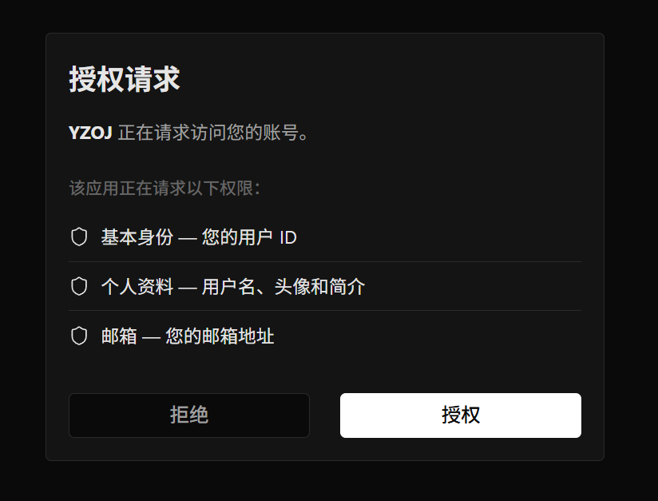

# login-with-cp-oauth

为你的 Hydro 添加使用 CP OAuth 登录！
> [!NOTE]
> 该插件部分代码使用 AI 生成。
## 快速开始
在您安装之前，请您[创建应用](https://auth.luogu.me/developer)。
```
mkdir -p /root/.hydro/addons
cd /root/.hydro/addons
git clone https://github.com/imsunxinhao/login-with-cp-oauth
hydrooj addon add /root/.hydro/addons/login-with-cp-oauth
```
然后登陆你的 Hydro，进入控制面板更改配置，修改 ID 和 Secret。
## 效果截图



